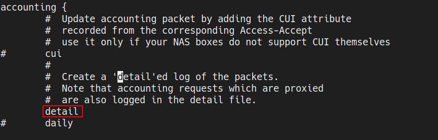
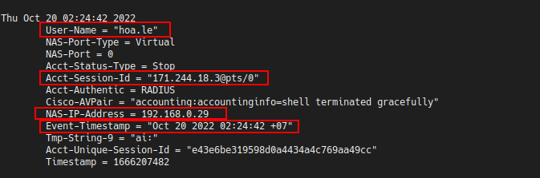
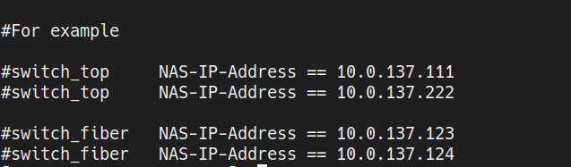
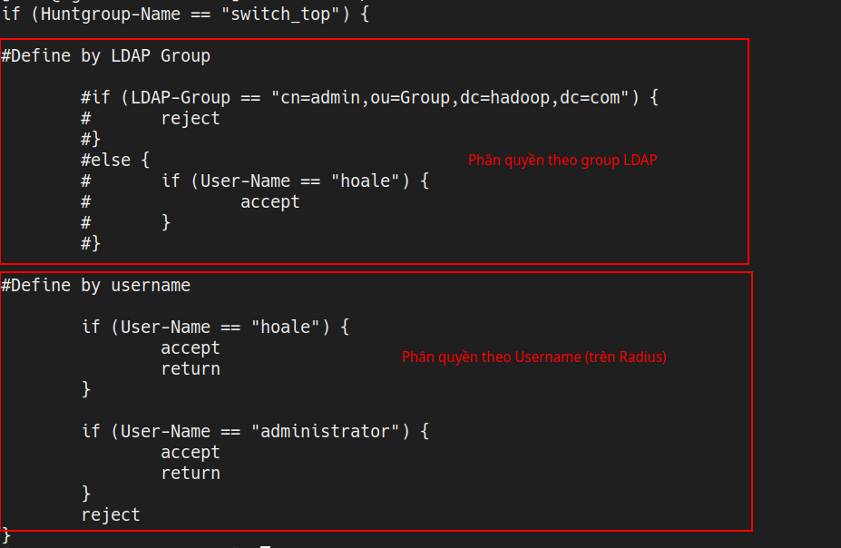

# Triển khai chứng thực Radius kết hợp LDAP với các thiết bị Cisco.
#### <a href="#1">1. Giới thiệu chung </a>
#### <a href="#2">2. Cài đặt </a>
#### <a href="#3">3. Chức năng radius server's Vietnix </a>
<hr>

<div id="1"></div>

## 1. Giới thiệu chung
### a. Lý thuyết

Dịch vụ chứng thực và phân quyền truy cập mạng (AAA) bao gồm:
- Authentication: xác thực nhằm đảm bảo nhận dạng đúng người dùng.
- Authorization: giới hạn phân quyền người dùng có thể truy cập vào hệ thống
- Accounting: Giám sát những hoạt động của user trên hệ thống/thiết bị.

Có hai giao thức bảo mật chính trong dịch vụ AAA là TACACS(*Terminal Access Controller Access Control System*) và RADIUS(*Remote Authentication Dial-In User Service*). Tacacs do Cisco phát triển có môt vài điểm khác biệt so với Radius. Cả hai đều có thể sử dụng đế chứng thực Wifi, các thiết bị mạng,...

Một số phần mềm:
- Cisco Identity Services Engine: https://www.cisco.com/c/en/us/products/collateral/security/identity-services-engine/guide-c07-656177.html (bản trả phí, yêu cầu cấu hình khá cao tuy nhiên có khá nhiều tính năng).
- Open source: Sử dụng các file config để cấu hình (https://www.pro-bono-publico.de/projects/tac_plus.html)
- Một phiên bản có giao diện của Tacacs (có cả miễn phí và trả phí)https://tacacsgui.com/
- Một ứng dụng open source hỗ trợ Radius: https://freeradius.org/

Ở trong bài này chúng ta sẽ cấu hình bằng FreeRadius.
### b. Yêu cầu
- Các user có thể login đc vào các thiết bị Cisco bằng tài khoản LDAP.
- Phân quyền truy cập dựa trên nhóm các thiết bị và nhóm user trên LDAP.
- Nhật kí ghi login, logout.

Sơ đồ hoạt động:


<div id="2"></div>

## 2. Cài đặt
### 2.1. Trên Radius server
#### a. Cấu hình cơ bản
FreeRadius sẽ chạy trên Linux, có thể sử dụng distro bất kì, trong bài viết này dùng CentOS 7.
```
yum install freeradius freeradius-utils freeradius-ldap
```
Các file cấu hình sẽ nằm trong thư mục: **/etc/raddb**

File cấu hình các thông số của radius server ở vị trí: **/etc/raddb/radiusd.conf**

FreeRadius quản lý server giống các web server như nginx và apache, file cấu hình sẽ nằm ở path **/etc/raddb/sites-enable** và đc symlink đến **/etc/raddb/sites-available**

Mặc định sẽ đọc config từ file **/etc/raddb/sites-enable/default**.

Bật tính năng xác thực với ldap


Cấu hình LDAP authentication:

```
cp etc/raddb/mods-available/ldap etc/raddb/mods-available
```

Lưu ý các thông tin sau:


Filter


Các thông tin về NAS sẽ được lưu trong file **/etc/raddb/clients.conf**

Định nghĩa client mới như ví dụ dưới đây. Lưu ý 2 trường thông tin qua trọng là IP và secret.


Chỉ định role network admin cho user authen bằng LDAP bằng cách thêm đoan code sau vào cuối file **/etc/raddb/users**

```
DEFAULT
#	Cisco-AVPair := "shell:priv-lvl=15"
	Cisco-AVPair := "shell:roles=\"network-admin\""
```

#### b. Cấu hình khác (optional)
Ghi nhật kí login logout

Bật tính năng ghi log chi tiết ở mục detail trong phần **accounting**



Trên switch cần bật tính năng ghi log ở server radius

```
aaa accounting default group radius
```

Kiểm tra đã được bật hay chưa


Log sẽ được lưu tại vị trí **/var/log/radius/radacct**.

Một session log:



Ở trên lưu ý một số trường được đánh dấu (thông tin cơ bản như: thời gian, IP kết nối vào, username,...)

### 2.2 Trên các thiết bị
Cấu hình AAA:
```
configure terminal
aaa authentication login console group radius
```
Cấu hình Radius:
```
configure terminal
radius-server host <IP của Radius server> key 0 <Key được định nghĩa trong file clients.conf ở trên>
ip radius source-interface mgmt0 <trong trường hợp này cấu hình đi local nên cần chỉ định interface khi thực hiện request đến radius server>
```
*Lưu ý: số ở phía sau từ **key** nằm trong danh sách sau (clear text (0), mã hóa (6) và (7)). Với cấu hình mẫu ở trên tuy ở dạng clear text nhưng ciso vẫn ẩn đi khi xem config*

<div id="3"></div>

## 3. Chức năng
### 3.1 Phân loại NAS theo IP
Cấu hình trong file **/etc/raddb/huntgroups**

Như file cấu hình mẫu dưới đây, 2 trường cần lưu ý là: cột đầu tiên chỉ tên group, cột cuối cùng xác định IP



### 3.2 Cấu hình phân quyền theo User-Name

Trong mục post_auth (bước phân quyền sẽ được thực hiện sau khi đã authentication thành công).



Trong phần cấu hình này chúng ta sẽ kết hợp với group được định nghĩa ở trên kèm với chọn Username để giới hạn chỉ những user được cấp quyền mới login đc vào những thiết bị được định nghĩa trước. 


